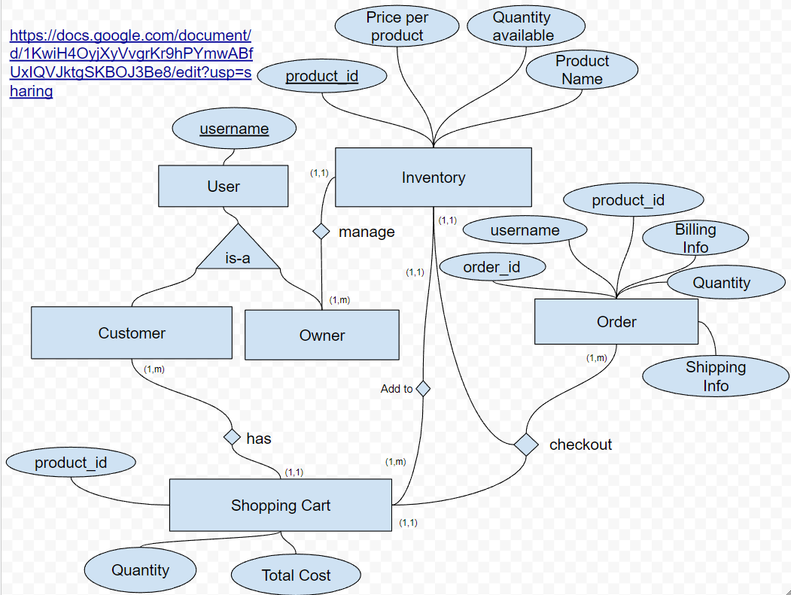

# hypestore
CSCI 466 Group Project: Hype Beast Web Store

## DB schema
- [project tables](https://docs.google.com/spreadsheets/d/1cPJKrGIBCxDm_qDSgNBjItgeaXRwLlNmgKw8SrmjlMc/edit#gid=0)
- [CSCI 466  GP - ER rough](https://docs.google.com/drawings/d/14QYu6aCWXa-usUrCyj_6au9k3xM5r93y6LHZ-vGa508/edit)
- [er conversion](https://docs.google.com/document/d/1KwiH4OyjXyVvgrKr9hPYmwABfUxIQVJktgSKBOJ3Be8/edit)

### 3NF

**USER** (<ins>userName</ins>, isEmployee)

**INVENTORY** (<ins>productID</ins>, productName, price, qty)

**ORDER** (<ins>orderID</ins>, userName&dagger;, billingINFO, shipINFO, hasShipped) 

* FOREIGN KEY (userName) REFERENCES USER(userName)

**ORDER_CONTENTS** (<ins>orderID, productID</ins>, orderQTY)

* FOREIGN KEY (orderID) REFERENCES ORDER (orderID)
* FOREIGN KEY (productID) REFERENCES INVENTORY (productID)

**SHOPPING_CART** (<ins>userName&dagger;, productID&dagger;</ins>, orderQTY)

* FOREIGN KEY (userName) REFERENCES USER(userName),
* FOREIGN KEY (productID) REFERENCES INVENTORY(productID)

**SHOPPING_CART_TOTAL** (userName&dagger;, total)

* FOREIGN KEY (userName) REFERENCES USER(userName)
